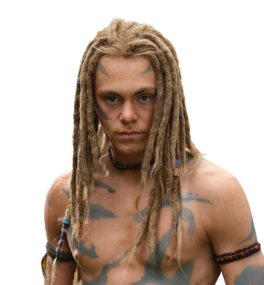
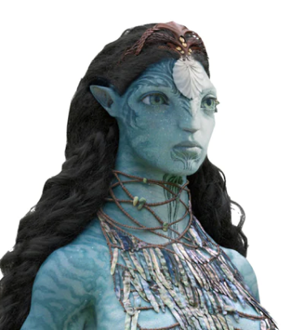
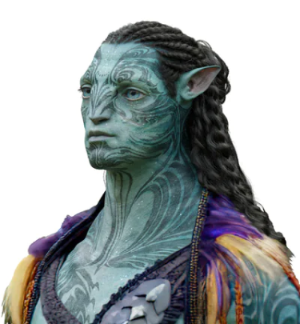
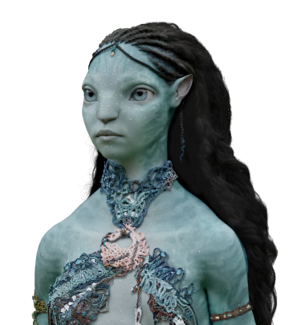
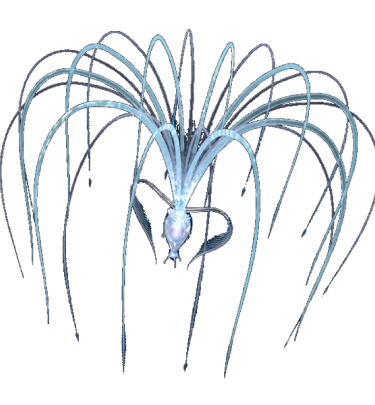

# Avatarfundamentos
<!DOCTYPE html>
<html lang="es">
  <head>
        <meta charset="UTF-8">
        <meta http-equiv="X-UA-Compatible" content="IE=edge">
        <meta name="viewport" content="width=device-width, initial-scale=1.0">
     <title>Avatar: The way of the water</title>
        <link rel="stylesheet" href="./css/estilos.css"/>
        <link rel="shortcut icon" href="./images/favicon.png" type="images/x-icon"/>
         
  </head>
   <body>

        <header class="header">

           

            
               <input type="checkbox" id="menu"/>
               <nav class="navbar">
                  <ul>
                     <li><a href="#">Inicio</a></li>
                     <li><a href="#">Peliculas<a</li>
                     <li><a href="#">Personajes</a></li>
                     <li><a href="#">Comics</a></li>
                  </ul>
               </nav>
           

           
           

            <h1> Avatar: The way of the water</h1>
            

              Sumergete en el mundo de Pandora, y conoce mas sobre los personajes y sus grandes aventuras.
            

            <a href="#" class="btn-1">Información</a>
           

        </header>

        
        <section class="Coffee">
            
            

               <h2>Personajes</h2>
                

                  Una decada despues de la guerra entre los Na'vis e humanos, Jake SUlly quien vive ahora como Na'vi es el lider del clan Omatikaya.
                  Cuano cree que al fin puede vivir una vida tranquila, los humanos regresan a Pandora, amenazando su tranquilidad.
                

                

                  

                     
                     <h3>Jake Sully</h3>   
                     

                        Ex marino paralitico de la tierra, remplaza a su hermano en el gobierno, haciendo que cree una nueva vida.
                     
                                                                                                                                                                                                                                                                                                                                                                                                                                                                                                                                                                                                                                                                                                                                
                  

                  

                     
                     <h3>Neytiri Sully</h3>   
                     

                        Hija del lider del clan, una de las mas fuertes guerreras dispuesta a defender a los suyos.
                     
                                                                                                                                                                                                                                                                                                                                                                                                                                                                                                                                                                                                                                                                                                                                
                  

                  

                     
                     <h3>Neteyam</h3>   
                     

                       Hijo de Jake Sully y Neytiri, siendo el hijo mayor de estos. Es amado por el clan, es muy perfecto cazador igual que su madre.
                     
                                                                                                                                                                                                                                                                                                                                                                                                                                                                                                                                                                                                                                                                                                                                
                  

                  

                     
                     <h3>Kiri Sully</h3>   
                     

               Hija adoptiva nacida del avatar de Grace, con padre desconocido. Tiene una fuerte conexion con Eywa.
                     
                                                                                                                                                                                                                                                                                                                                                                                                                                                                                                                                                                                                                                                                                                                                
                  

                  

                     
                     <h3>Loak Sully</h3>   
                     

                      Se considera la oveja negra de la familia Sully, ya que siempre se mete en problemas.
                     
                                                                                                                                                                                                                                                                                                                                                                                                                                                                                                                                                                                                                                                                                                                                
                  

                  

                     
                     <h3>Tuktirey Sully</h3>   
                     

                        Hija menor de los Sully, todos la aman, ya que es tierna e inocente.
                     
                                                                                                                                                                                                                                                                                                                                                                                                                                                                                                                                                                                                                                                                                                                                
                  

                  

                     
                     <h3>Spider</h3>   
                     

                       Hijo del coronel Quaritch, Fue criado por la familia Sully, tiene una gran conexion con Kiri.
                     
                                                                                                                                                                                                                                                                                                                                                                                                                                                                                                                                                                                                                                                                                                                                
                  

                  

                     
                     <h3>Ronal</h3>   
                     

                        Chamana de los Metkayina, esposa de Tonowari, es una mujer ruda y valiente.
                     
                                                                                                                                                                                                                                                                                                                                                                                                                                                                                                                                                                                                                                                                                                                                
                  

                  

                     
                     <h3>Tonowari</h3>   
                     

                        Lider del clan Metkayina, es un lider muy respetado, su clan se encuentra muy alejado de la guerra, amigo de Jake Sully.
                     
                                                                                                                                                                                                                                                                                                                                                                                                                                                                                                                                                                                                                                                                                                                                
                  

                  

                     
                     <h3>Tsireya</h3>   
                     

                        Hija de Ronal y Tonowari, es un amor de persona, le gustan las nuevas personas, y ama mucho a su familia y clan.
                     
                                                                                                                                                                                                                                                                                                                                                                                                                                                                                                                                                                                                                                                                                                                                
                  

                  

                     
                     <h3>Ao'nung</h3>   
                     

                       Primer hijo de Ronal y Tonowari, Es rebelde y siente que es la oveja negra de su familia, ya que siempre decepciona a sus padrea
                     
                                                                                                                                                                                                                                                                                                                                                                                                                                                                                                                                                                                                                                                                                                                                
                  

                  

                     
                     <h3>Ma'Eywa</h3>   
                     

                      Es la creadora de pandora, ama a todos sus hijos por igual.
                     
                                                                                                                                                                                                                                                                                                                                                                                                                                                                                                                                                                                                                                                                                                                                
                  

                

                <a href="#" class="btn-1">Información</a>
            

        </section>   

        <main class="services">

            

                  <h2>  Orden de peliculas</h2>

                  

                     

                           
                           <h3> Avatar 1 </h3>
                           
Estrenada en el 2009, si quieres conocer mas este mundo, esta es el primer film de la pelicula para comprender de que trata el segundo film.
                           

                     

                     

                        
                        <h3> Avatar 2: the way of the water</h3>
                        
Segunda film de avatar, estrenada en el 2023, alcanzando el puesto de la pelicula mas taquillera, despues del Titanic producida por el mismo James Cameroon.
                        

                     

                  

               <a href="#" class="btn-1">Información</a>
            

        </main>
        <section class="general">

         

               <h2>Comic de Avatar</h2>
               
               

                  Sabias que Avatar tiene comics, y si quieres conocer la historia mas a profundidad puedes leerlo, ya que diversos detalles no fueron incluidos en la pelicula.
               

                  <a href="#" class="btn-1">Informacion</a>
         

         

         

            <h2>Datos</h2>
            
            

               Avatar fue la primera pelicula grabada totalmente bajo agua, sometiendo a sus actores a entrenar diversas cosas, tales cuales: Arqueria, cazar, nadar, aguantar la respiracion, entre otras tantas cosas.
            

               <a href="#" class="btn-1">Informacion</a>
      

      

        </section>

        
       
        <footer>

            

                  

                        <h3>Nombre</h3>
                        <ul>
                           <li><a href="#">Juberkys Matos Feliz</a></li>
                        </ul>
                  

               

                  <h3>Matricula</h3>
                      <ul>
                        <li><a href="#">23-EISM-1-121</a></li>
                        
               

               

                  <h3>Sobre</h3>
                      <ul>
                        <li><a href="#">Soy estudiante de ingenieria en sistema.
                           Cursando mi primer cuatrimestre, y esta es mi primera pagina web.
                        </a></li>   
                     </ul>
               

            

        </footer>

   </body>
</html>
